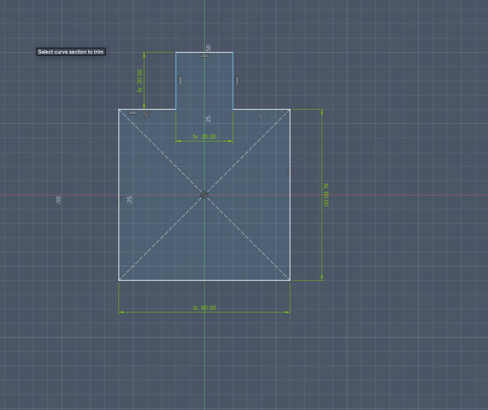
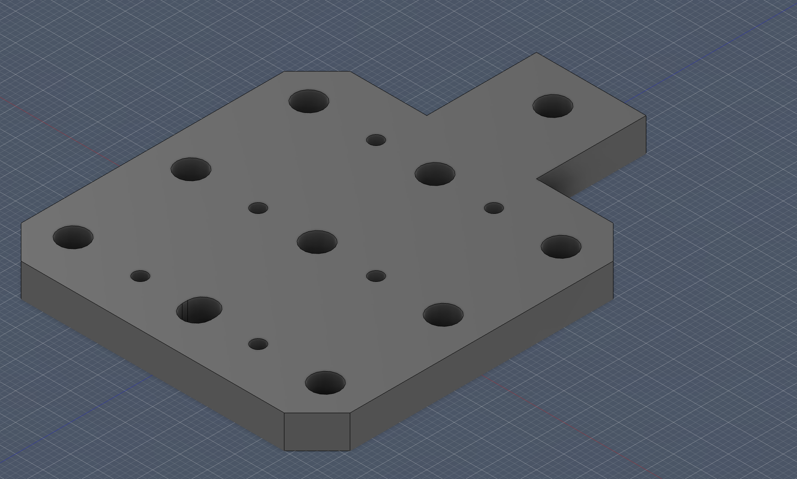
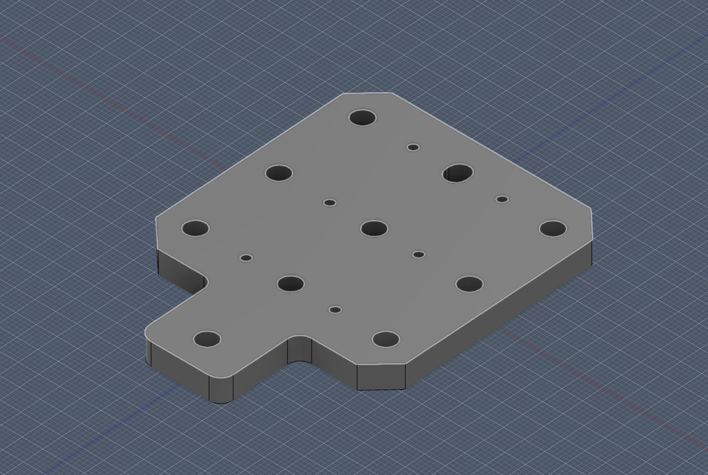

## Bearing Plate Design Process
First, I created the base sketch.

Then, I added the screw holes.

Next, I modified the back hole into a slot with slightly more clearance.

After that, I extruded the sketch.

Then, I chamfered the outer edges.

Finally, I added chamfers to the bottom square edges and fillets to the top square edges. The design was complete.

