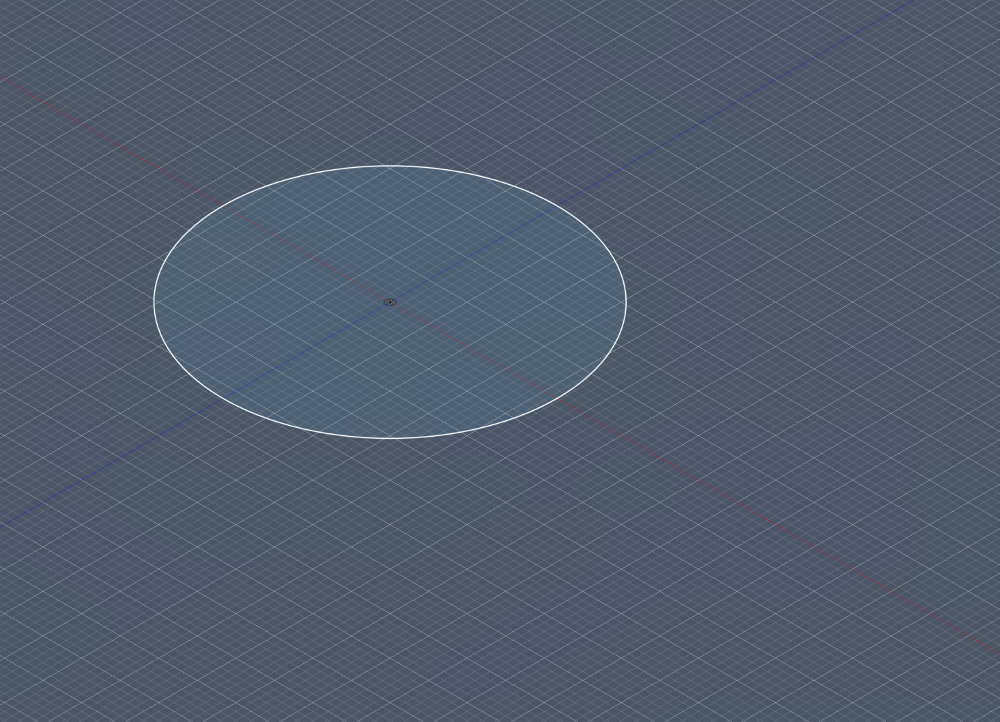
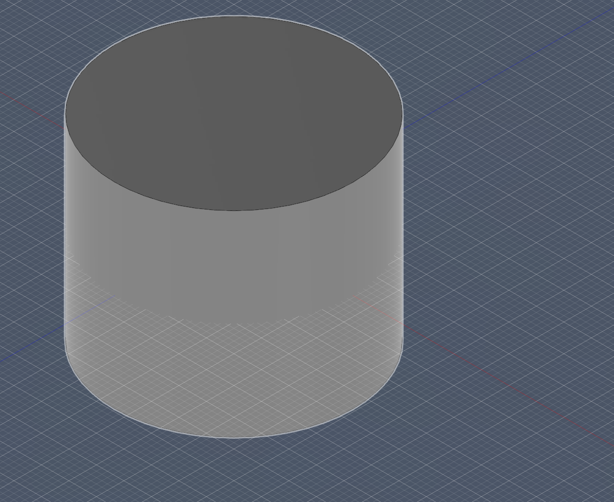
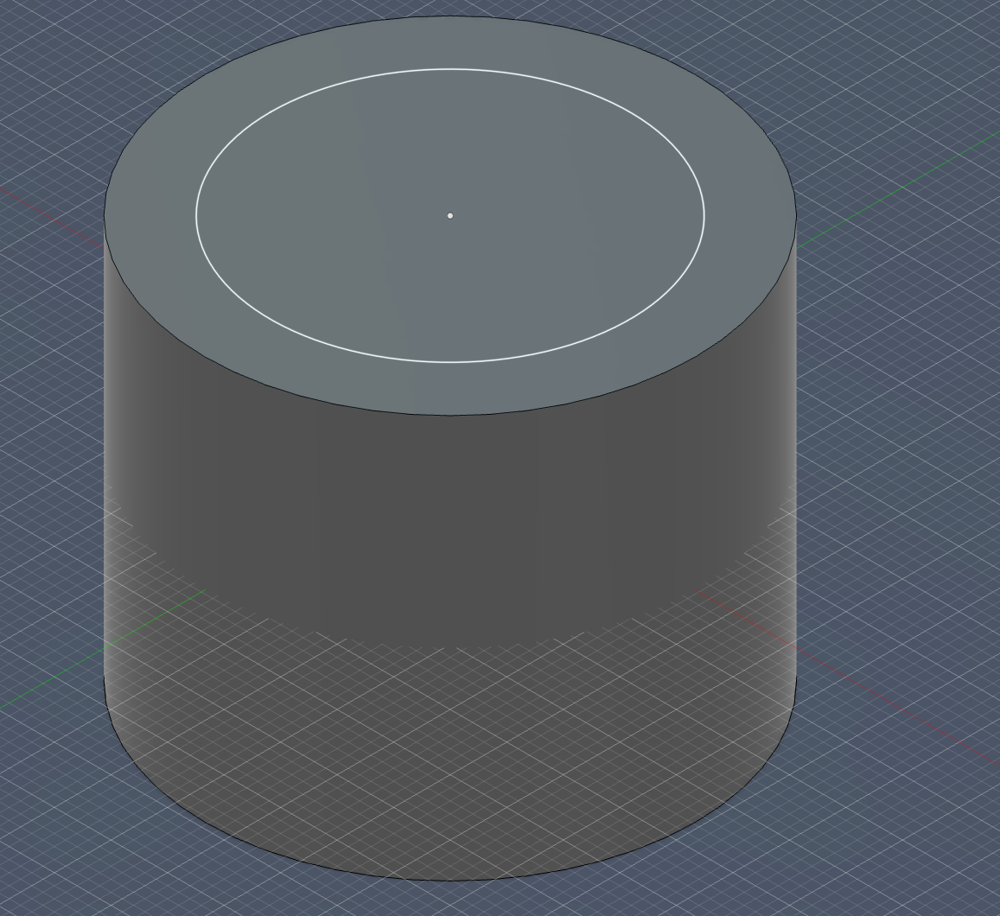
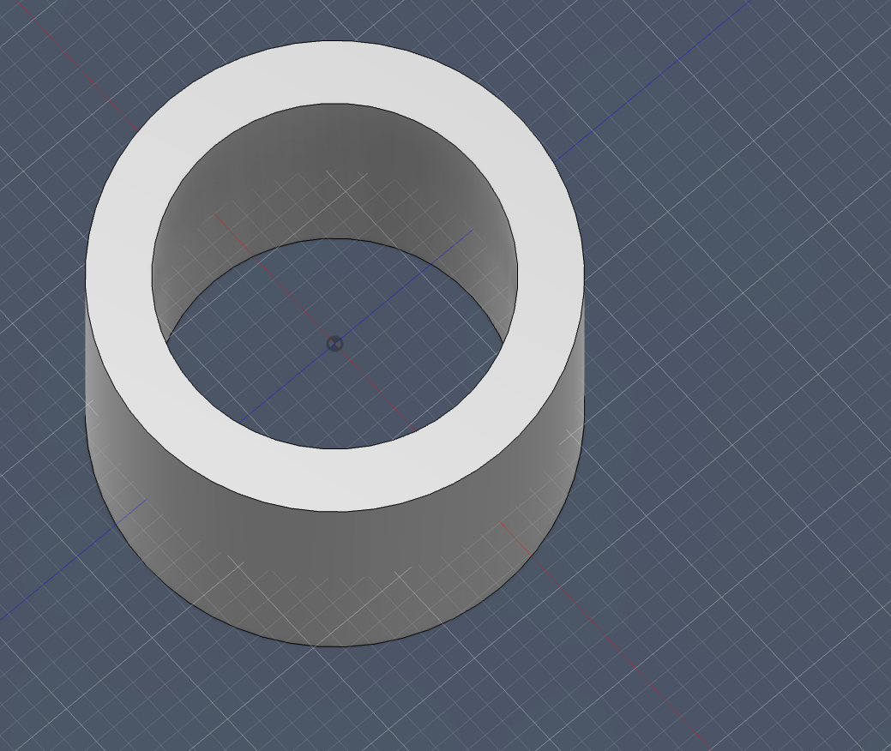
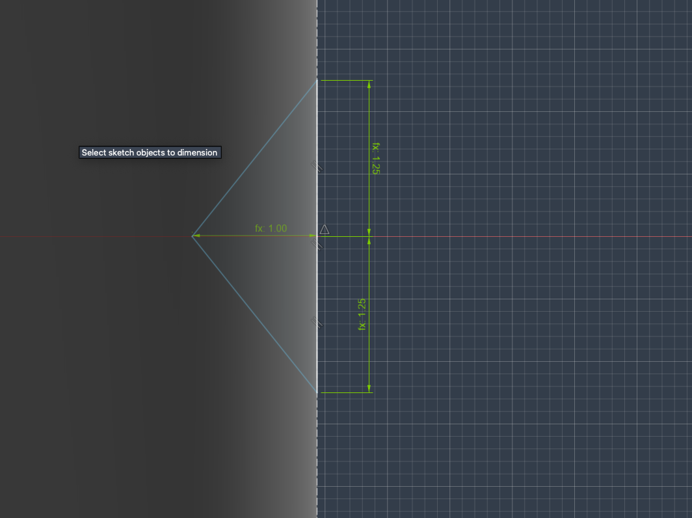
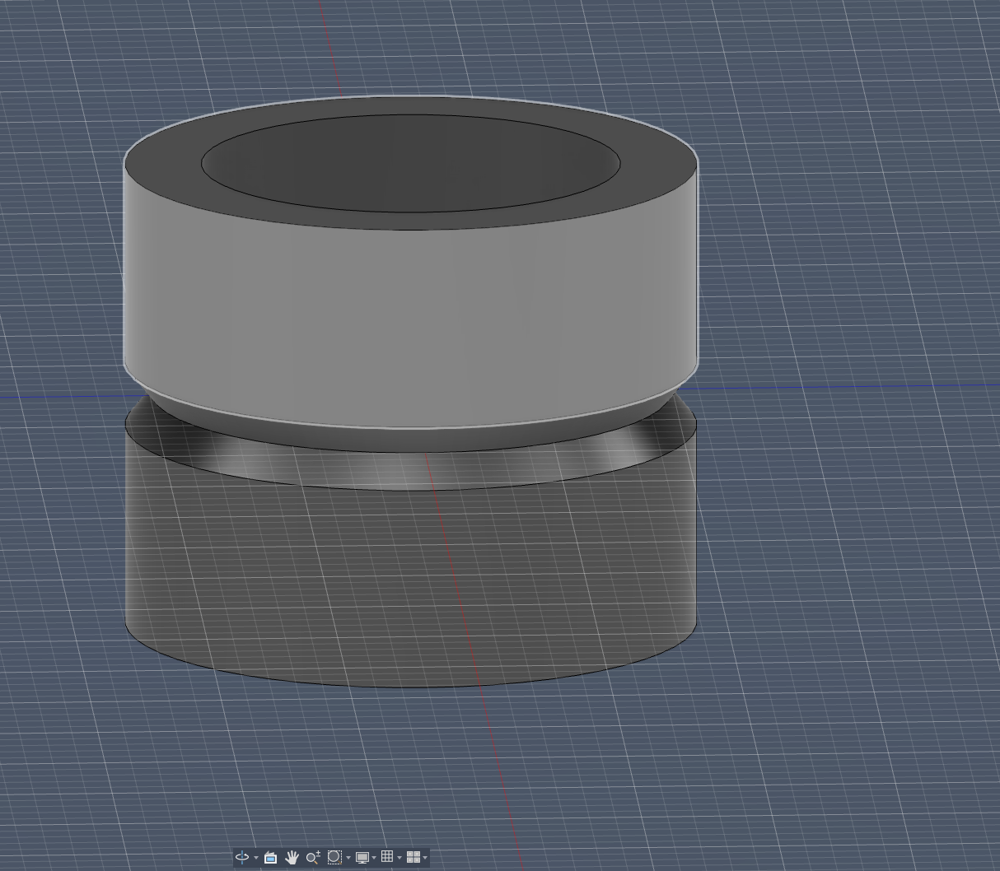
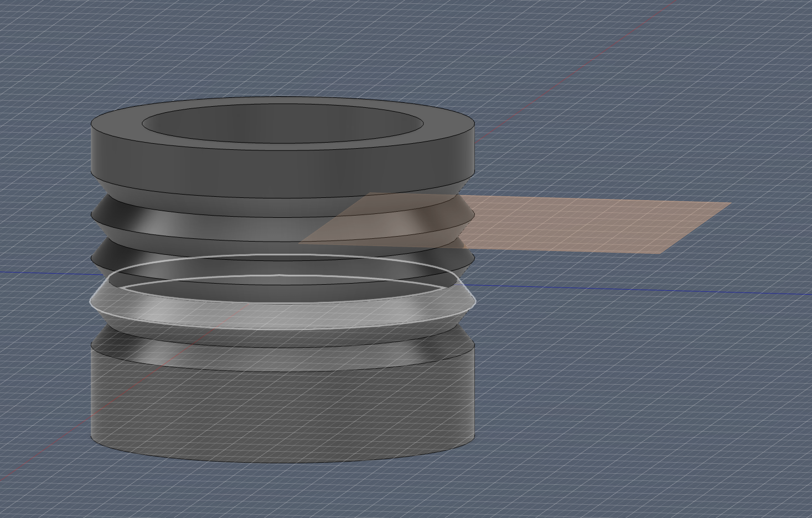
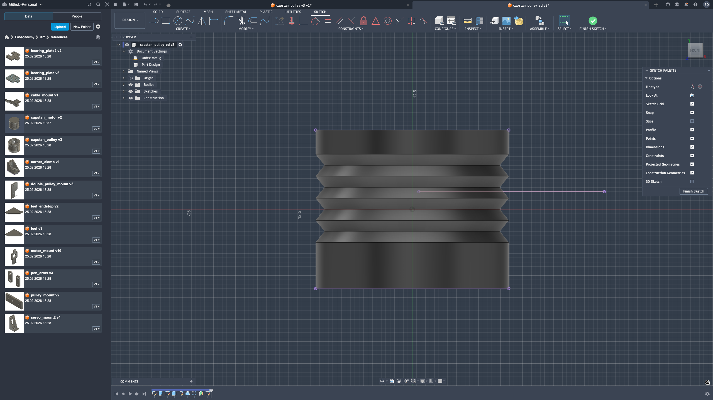
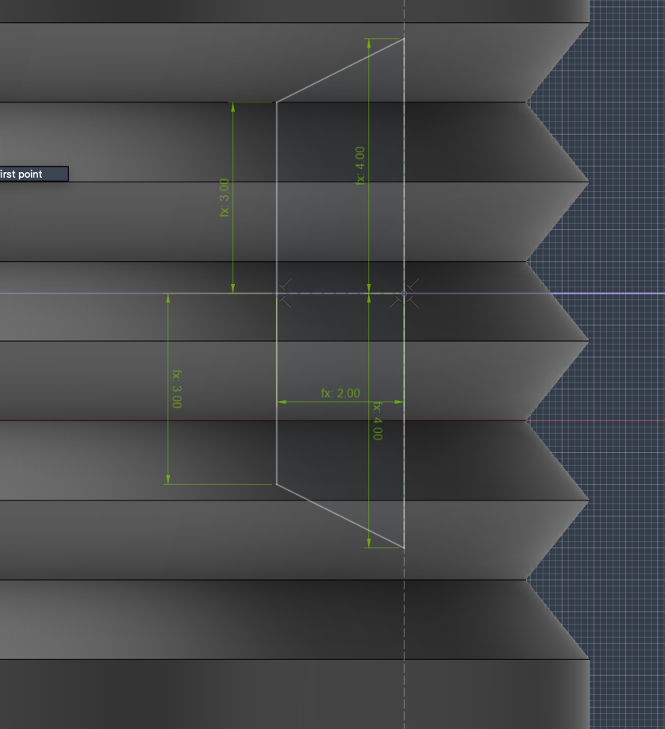
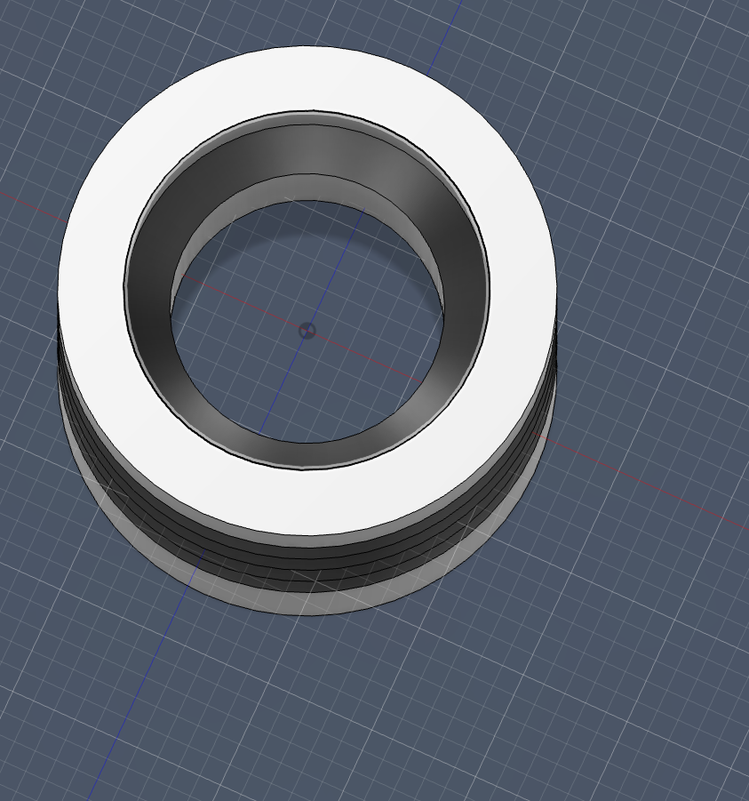

Again, I did the base circle with the said dimensions:  

Then, using symmetric extrusion, I extruded it to 18 mm:  

Next, I sketched and performed a through-hole cut for the top hole:  
  

After that, I created the revolution triangle sketch:  

And revolved it:  

Then I created a construction plane to draw the bearing holder:  

I projected that side of the construction plane onto the ZY plane to make another revolve template:  

Next, I added the revolution sketch:  

Final result:  

