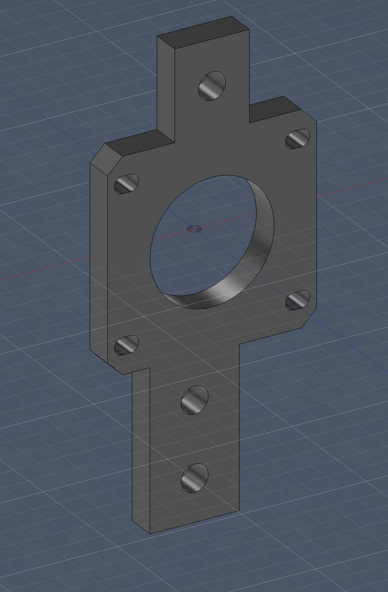
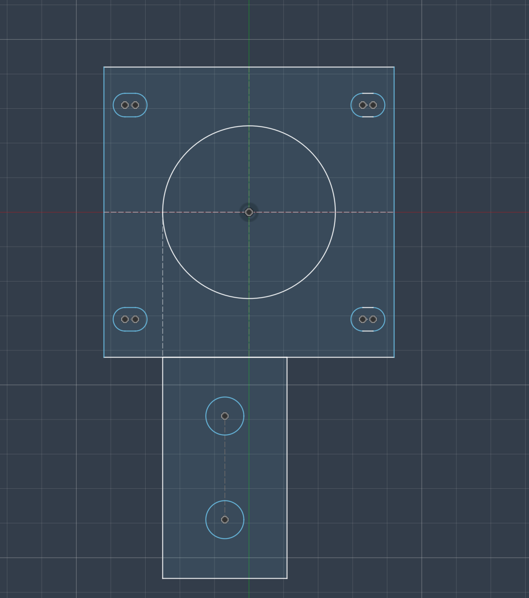
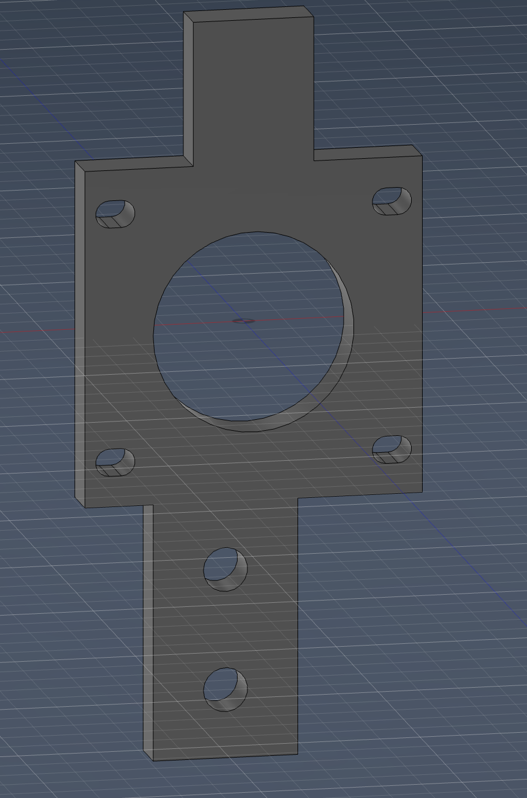
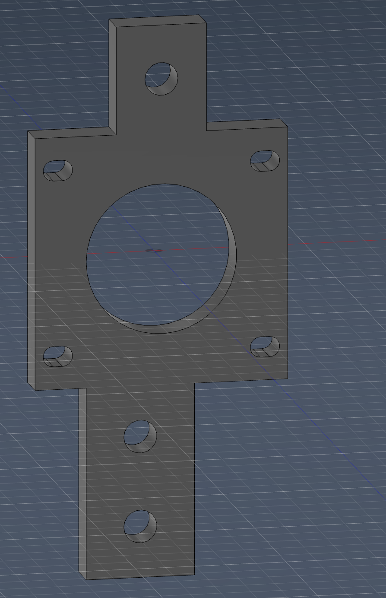

# Hero Shot

# Explanation

This is the initial sketch, which mostly makes up the base of the motor mount. The mount hole is fitted for a NEMA 17 motor. The slot holes are for M3 screws, while the two large holes are used to stabilize the holder on the profiles.  

The downward part of the holder is slightly offset to the right so that the capstan motor and pulleys align with the center of the motor for efficient movement. As you can see, it is directly aligned with the left side of the motor mount as well.  

Next, it was extruded and extended onto the other part of the sketch.  

I added this top part:  

Then I created a precise cutout:  

This was done so the pulley could fit behind the motor’s extension on the NEMA shaft.  

**The motor mount is done.**
