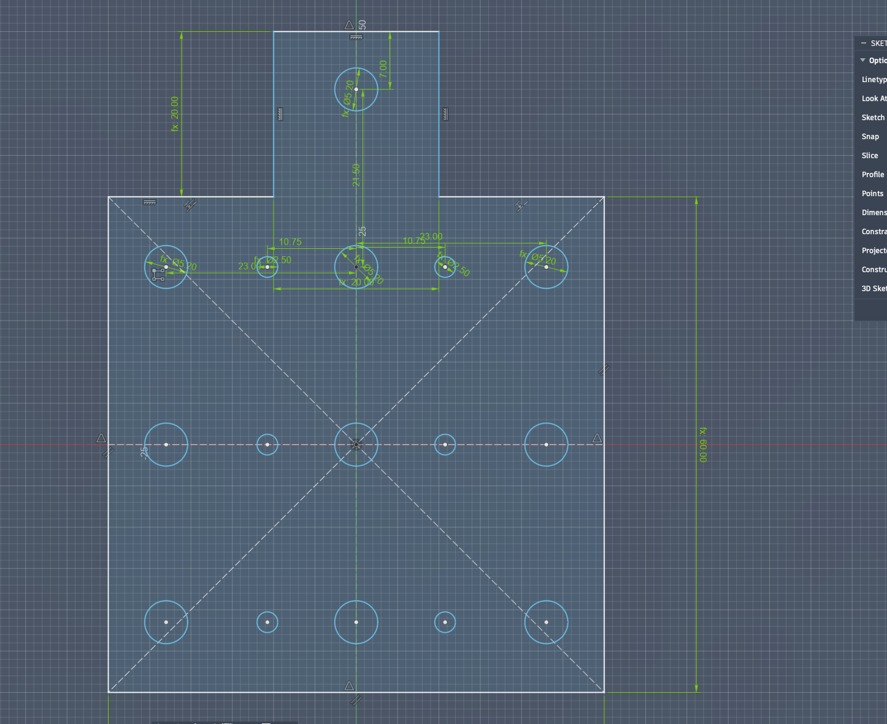
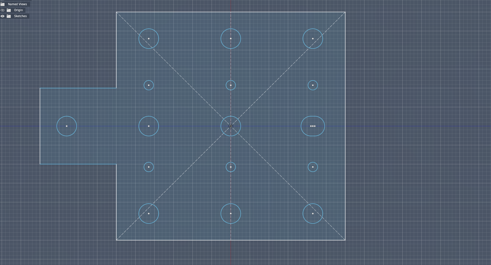
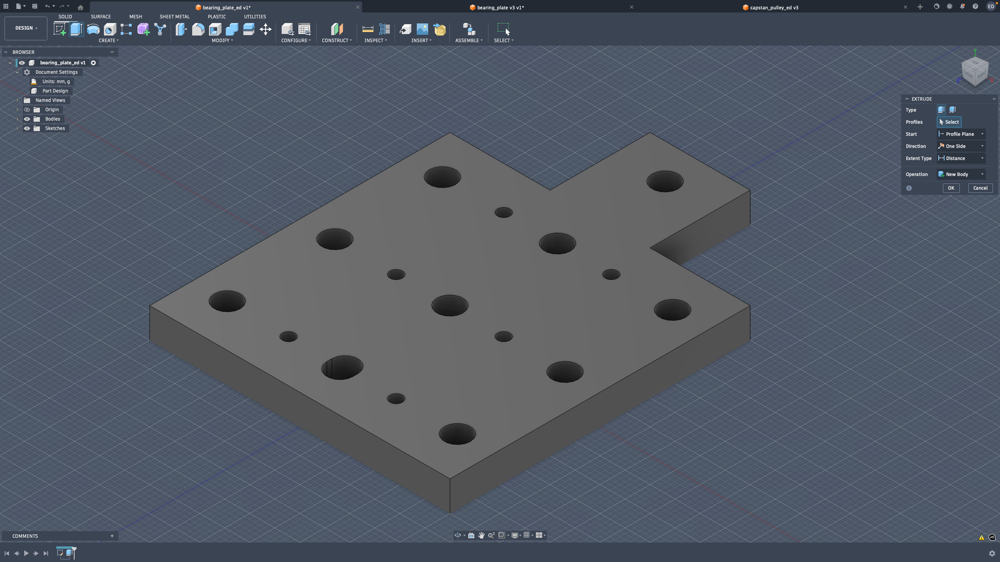

# Base Part Design

First, I created the base sketch:  

Then, I added the screw holes:  

Lastly, I modified the back hole into a slot with slightly more space:  

Next, I extruded the part:  

Then, I chamfered the outer edges:  

Finally, I added chamfers to the sides of the bottom squares and fillets to the sides of the top squares. The design was then completed:  

